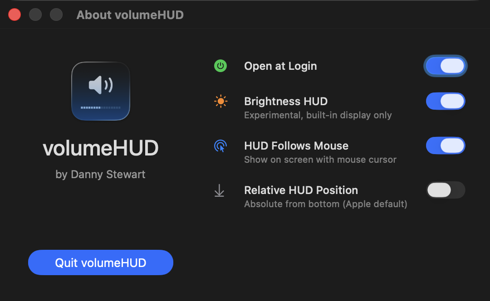

# volumeHUD

A simple macOS app that brings back the classic volume and brightness HUDs.

## Why This Exists

With macOS Tahoe, Apple revamped Control Center and replaced the classic volume and brightness indicators of 25 years with tiny popovers in the corner of the screen, even smaller than notifications. They're hard to see, especially against light backgrounds, and they disappear before I remember where to look. Even after months on the Tahoe beta I haven't gotten used to them. It's bad UI.

So I did what any sane person would do: I picked up Xcode and wrote my first ever Mac app to bring back the classic macOS HUDs we all know and love (except Apple, apparently). They do what any good system indicator should do: they show you the level when you change it and then they go away. And get this—you can actually *see them*. A groundbreaking feature in 2025.

## What It Looks Like

</img>

## Usage

Just launch the app! You should see a notification that it started, and you can begin enjoying your new (old) volume HUD right away. If you launch the app a second time, you'll get a window where you can set it to open at login, configure HUD preferences, and quit. It will also show when an update is available.

</img>

As of version 2.0, volumeHUD supports brightness. It is **off by default** (this is *volumeHUD*, after all), and it is **experimental and unsupported**. It will only work for built-in displays, and it may not be bulletproof for automatic changes like power source or ambient light, though it does mostly catch these.

As of version 3.0, **volumeHUD hides the system HUD**. It does this by intercepting the volume/brightness keys and handling volume/brightness changes directly, instead of having the OS do it. There is a safety check to make sure the volume/brightness has actually changed after you press a key; if not, the app assumes key interception is not working and disables it until a device change or the app is restarted. This ensures you can still change volume or brightness even if this doesn't work on your system.

## Installation

You can download it from the repo, but I strongly recommend installing via Homebrew, as that will handle updates for you. It's my first Swift app, so I don't want you to be left with any lingering bugs.

```bash
brew install dannystewart/apps/volumehud
```

You can uninstall with `brew uninstall volumehud`, which should remove all traces of the app, including preferences and login item. No permissions should be left behind either once the app is gone.

## Permissions

I worked hard to ensure the app could function without requiring any permissions. It will request two that are **optional but recommended**.

- **Notifications** are used only to confirm the app has started (and only when launched manually, not as a login item). Feel free to disable if you find them unnecessary.
- **Accessibility** is needed for full functionality. The app will work without it, but you lose some features:
  - The system HUD will still appear alongside volumeHUD.
  - The HUD won't appear if you go below 0% or above 100% since it can't use key presses to determine if levels should have changed.
  - Brightness checks may be less reliable since key timing can't be used to check whether a change is user-initiated.

Apart from that, all other features should work.

## Troubleshooting

If you're experiencing inconsistent behavior, the most likely cause is lack of Accessibility permissions, and the first thing I would recommend is a full reset. The most thorough way to do this is to uninstall and reinstall:

1. Completely quit volumeHUD by opening it a second time and clicking **Quit volumeHUD**.
2. Open **System Settings** → **Privacy & Security** → **Accessibility**.
3. Find **volumeHUD** in the list, select it, and click the minus (-) button at the bottom. Make sure it's removed from the list.
4. Assuming you installed with Homebrew, run `brew uninstall volumehud` to remove the login item, the app, and any remaining files.
5. Run `brew install dannystewart/apps/volumehud` to reinstall.
6. Reopen **volumeHUD.app**. You should be prompted with "this application has been downloaded from the internet" first, followed by a request for Accessibility permissions.
7. Open **System Settings** like it says to do, make sure **volumeHUD** is in the list now, and toggle it on. If it says you'll need to quit and reopen, do that and try again.

There was an issue with pre-2.0 versions where volumeHUD didn't request those permissions properly, so if you've been using the app since before then, they're very likely not configured correctly and should be reset.

## License

This project is open source under the [MIT License](./LICENSE). Feel free to do what you like with it, or contribute!

<a href="https://www.buymeacoffee.com/dannystewart" target="_blank"></a>
