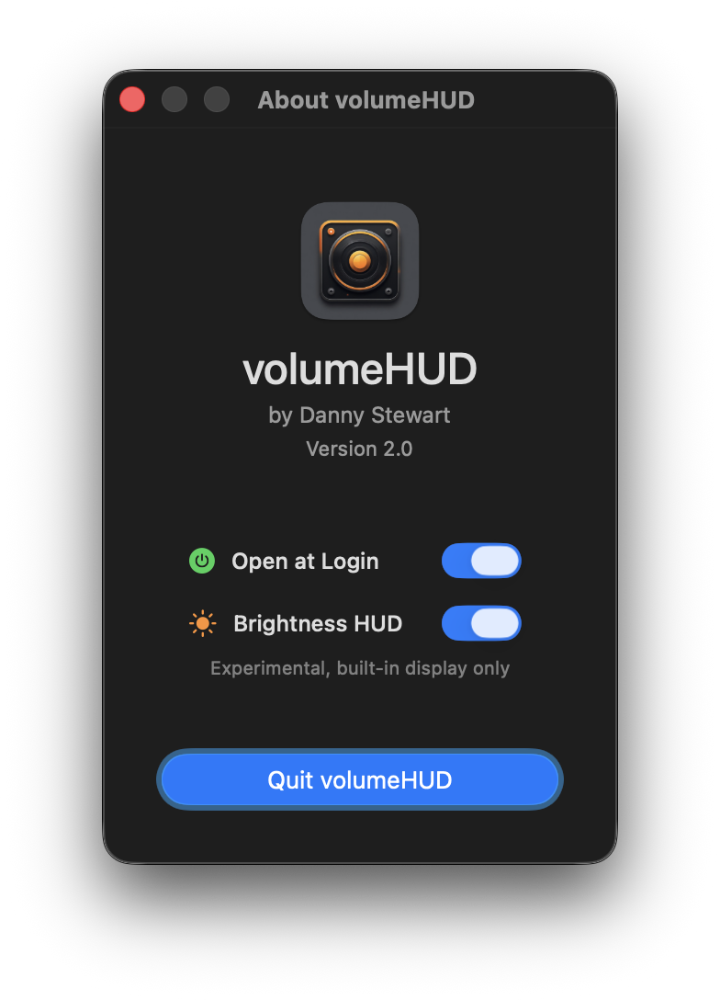

# volumeHUD

A simple macOS app that brings back the classic volume and brightness HUDs.

## Why This Exists

With macOS Tahoe, Apple revamped Control Center and replaced the classic volume and brightness indicators of 25 years with tiny popovers in the corner of the screen, even smaller than notifications. They're barely visible, especially against light backgrounds, and they disappear before I remember where to look. Even after months on the Tahoe beta, I still haven't gotten used to it. It's bad UI.

So I did what any sane person would do: I picked up Xcode and wrote my first ever Mac app to bring back the classic macOS HUDs we all know and love (except Apple, apparently). They do what a good system indicator should do: they show you the value when you change them and then they go away. And get this—you can actually *see them*. A groundbreaking feature in 2025.

## What It Looks Like

</img>

## How to Use It

### Installation

You can get it from the repo, but I strongly recommend installing via Homebrew:

```bash
brew install dannystewart/apps/volumehud
```

### Interface

Launching the app a second time after it's running will show a window with some options:

</img>

Here, you can set the app to open at login and enable the brightness HUD, which is disabled by default. It may be less reliable than the volume HUD, and it only supports built-in displays. (Besides, the app is *volumeHUD*. Brightness is a bonus.)

The window also provides a button to quit at the bottom, and will display a little "Update available!" under the version number when there's… an update available.

### Permissions

The app will ask for two permissions, both of which are **completely optional:**

- **Accessibility:** The app works by detecting changes to volume and brightness. This means the HUD won't appear when you try to go below 0% or above 100% because the levels don't change. Input monitoring works around this by watching for key presses. That's the only thing you'll lose if you leave it off.
- **Notifications:** Notifications are used only to tell you that the app has started. It only happens when the app is launched manually, not if it's set to run on startup.

## License

This project is open source under the [MIT License](./LICENSE). Feel free to do what you like with it, or contribute!

<a href="https://www.buymeacoffee.com/dannystewart" target="_blank"></a>
